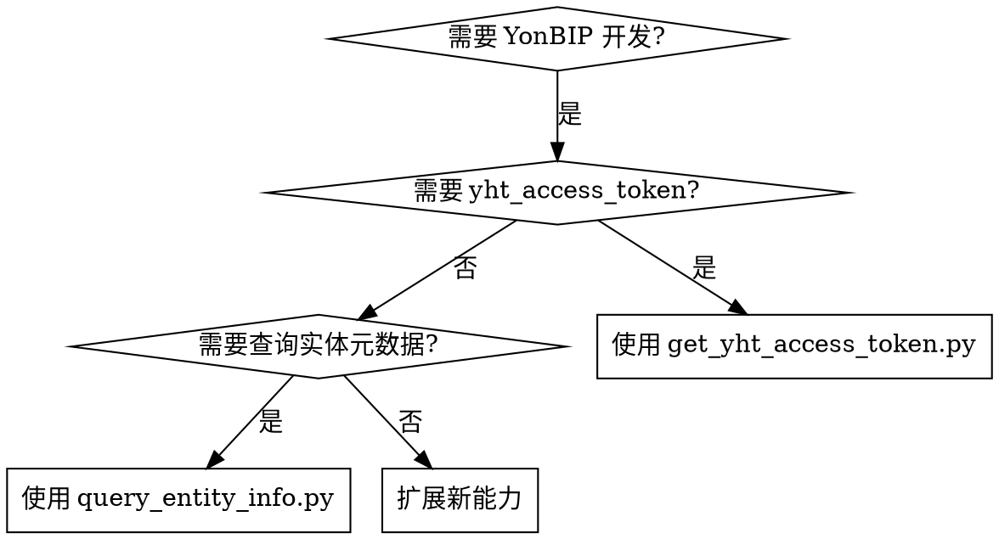

# YonBIP 开发技能

## 概述

YonBIP 开发辅助技能，提供常用脚本简化开发流程。当前支持：
- 获取友互通 Token (yht_access_token)
- 根据实体 URI 查询实体信息
- 导出实体元数据为 Markdown 文档（自动缓存）

## 使用时机



## 快速参考

| 脚本 | 用途 | 必需参数 | 依赖 |
|------|------|----------|------|
| `scripts/get_yht_access_token.py` | 获取 yht_access_token | userId | 无 |
| `scripts/query_entity_info.py` | 查询实体元数据 (JSON) | entity_uri | 有效 token 缓存 |
| `scripts/export_entity_md.py` | 导出实体元数据为 Markdown | entity_uri | 有效 token 缓存 |

## 环境配置

| 环境变量 | 说明 | 默认值 |
|----------|------|--------|
| `YONBIP_BASE_URL` | YonBIP 基础 URL | `https://lhdftest.yonyoucloud.com` |
| `YONBIP_TOKEN_CACHE_DIR` | Token 缓存目录 | 脚本目录下的 `.token-cache` |
| `YONBIP_ENTITY_CACHE_DIR` | 实体文档缓存目录 | 脚本目录下的 `.entity-cache` |

## Token 管理

### 获取 Token

```bash
python scripts/get_yht_access_token.py <userId>
```

- 首次调用会请求新 token 并缓存
- 缓存有效期 12 小时，过期后自动重新获取
- Token 存储在 `.token-cache/yht_access_token.json`

### 使用缓存 Token

其他脚本自动从缓存读取 token，无需重复获取：

```bash
# 查询实体信息（自动使用缓存的 token）
python scripts/query_entity_info.py areaFormat.model.areaFormatRecord
```

## 脚本说明

### scripts/get_yht_access_token.py

获取友互通 Token 的完整流程：
1. 调用 `/cas/exclusive/genLoginTokenByUserIdLimitIp` 获取登录 token
2. 构造登录跳转 URL
3. 跟随重定向获取最终 URL
4. 从 Cookie 中提取 `yht_access_token`
5. 缓存到本地文件（12 小时有效）

### scripts/query_entity_info.py

查询实体元数据：
- 端点: `/iuap-metadata-base/ext/MDD/entity/db/info`
- 参数: `uri` (实体 URI)
- 认证: 使用缓存的 `yht_access_token`

### scripts/export_entity_md.py

导出实体元数据为 Markdown 文档，包含基本信息、约束、属性列表：
- **自动缓存**：首次查询 API 并生成 Markdown，后续直接从缓存读取
- **输出格式**：包含基本信息表、约束列表、属性列表（序号/编码/名称/类型/引用/标签/来源/表名/表字段名/描述）
- **缓存位置**：`.entity-cache/{entity_uri}.md`

```bash
# 导出实体 Markdown（首次请求 API，后续走缓存）
python scripts/export_entity_md.py les.driver.driver
```

## 常见错误

| 错误 | 原因 | 解决方法 |
|------|------|----------|
| 未找到缓存文件 | 未先获取 token | 先运行 `scripts/get_yht_access_token.py` |
| 缓存文件格式无效 | 缓存文件被破坏 | 删除 `.token-cache` 目录重新获取 |
| HTTP 401/403 | Token 过期或无效 | 删除缓存重新获取 token |
| 无法解析 location.href | 登录流程变更 | 检查 BASE_URL 是否正确 |
